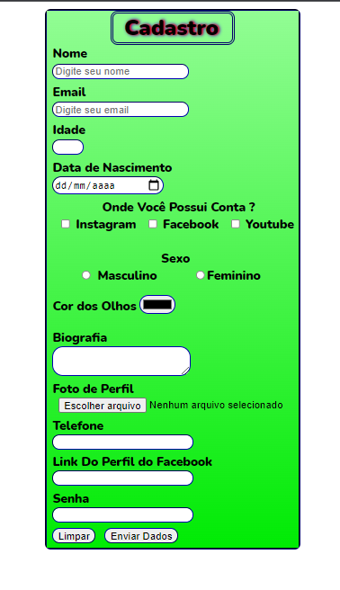

## Projeto formulário de cadastro

> Formulário de cadastro feito com HTML e CSS

### 🛠️ Ajustes e melhorias:

O projeto está finalizado, porém aberto para novas modificações. As atualizações serão voltadas nas seguintes tarefas:

- [x] Utilização do HTML 
- [x] Utilização do CSS
- [ ] Alterações das cores

### 🎯 Objetivo:

Esse foi meu segundo projeto desenvolvido para mostrar alguns comandos do HTML estilizado com CSS. Visando
exibir as mudanças visuais que o CSS é capaz. E vai muito além desse projeto.

#### 🤝 Desenvolvido por:

<table>
  <tr>
    <td align="center">
      <a href="https://www.linkedin.com/in/jos%C3%A9-nataniel-4764a4224/">
         
        
          <b>Nataniel Andrade</b>
        
      </a>
  </tr>
</table>

